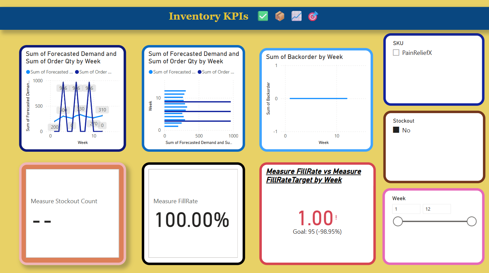

# 📊 NexoPharma Supply Chain Simulation Dashboard

This Power BI dashboard simulates a 4-tier pharmaceutical supply chain—from supplier to customer—offering real-time visualization of demand fulfillment, inventory performance, and key operational KPIs.

## 🚀 Project Overview

**Objective:**  
To model and visualize a simulated supply chain for a pharmaceutical company using Power BI, with the goal of identifying bottlenecks, optimizing inventory levels, and tracking critical performance metrics like Fill Rate and Stockouts.

**Scope Includes:**
- EOQ and Safety Stock calculations (via Excel inputs)
- 12-week inventory flow simulation
- Demand vs Order alignment analysis
- Power BI dashboard with advanced visual storytelling

---

## 📂 Files Included

| File Name                                 | Description                                  |
|------------------------------------------|----------------------------------------------|
| `NexoPharma_SupplyChain_Dashboard.pbix`  | Main Power BI report                         |
| `sales_data_sample.json` *(optional)*     | Sample input data format used in simulation  |
| `README.md`                               | Project overview and documentation           |

---

## 📊 Key Visuals in Dashboard

- **Forecasted Demand vs Order Quantity**  
  Compares actual order placements against predicted demand.

- **Ending Inventory Over Time**  
  Area chart showing inventory levels post fulfillment weekly.

- **KPI: Fill Rate (%)**  
  Measures service level: proportion of demand fulfilled on time.

- **Stockout Count Indicator**  
  Highlights weeks where inventory was insufficient.

- **Backorders by Week**  
  Bar chart showing unfulfilled units across the 12-week simulation.

---

## 🛠 Tools Used

- Power BI Desktop (Data Modeling, DAX, Visualization)
- Microsoft Excel (EOQ, Safety Stock logic)
- DAX Measures (Fill Rate, Stockout Count)
- JSON (Simulated sales data input)

---

---

## 🧠 Learning Outcomes

- Demonstrated ability to simulate inventory systems and calculate critical supply chain metrics
- Applied DAX to derive meaningful KPIs from raw weekly data
- Created a clean, executive-level dashboard with actionable insights

---

## 👤 Author

**Suhas Reddy Challa**  
📫Github [[GitHub Profile](https://github.com/suhasreddychalla)  ](https://github.com/suhasreddychalla)
🔗LinkedIn [(www.linkedin.com/in/suhas-challa-799173184)](https://www.linkedin.com/in/suhas-challa-799173184/)

---

## 📄 License

This project is shared for learning and demonstration purposes. For any commercial use, please contact the author.
